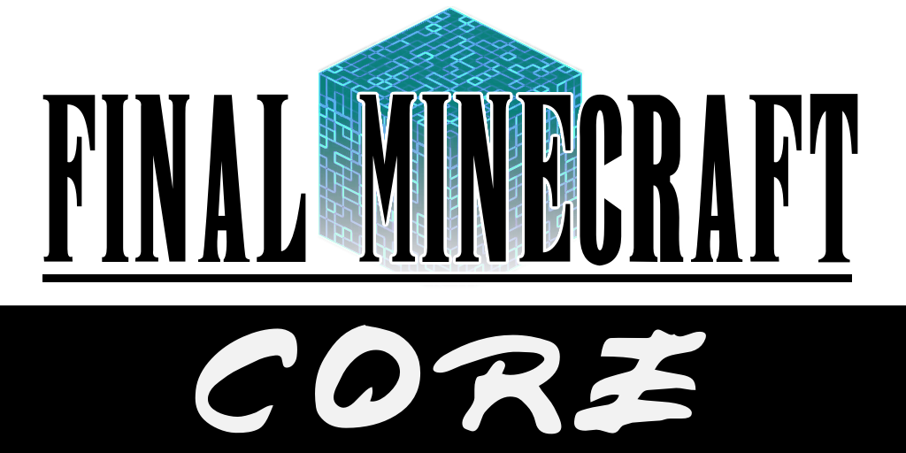

<h1 align=right> By Lafolie </h1>

## Final Minecraft is a [Fabric mod](https://www.fabricmc.net/) for [Minecraft](https://www.minecraft.net/en-us) 1.18.2


# Features

Final Minecraft adds a variety of Final Fantasy inspired content to Minecraft.

**Current features:**
* [Elemental Aspects](https://github.com/Lafolie/Final-Minecraft/wiki/Elemental-Aspects)
* [Damage Numbers](https://github.com/Lafolie/Final-Minecraft/wiki/Damage-Numbers)
* [Calendar System](#)
* [Crystals](https://github.com/Lafolie/Final-Minecraft/wiki/Crystals)
* ~~Status effects~~

For detailed information about the mod, [visit the wiki](https://github.com/Lafolie/Final-Minecraft/wiki).

You can also [join the official Final Minecraft Discord](https://discord.gg/Kv6umW2vzy).
### Supported Versions

As the mod is still in alpha, there is no release.

**Version Info**
* Release date: `00/00/2022`
* Final Minecraft: `0.1.0 "Biggs"`
* For Minecraft Java: `1.18.2 "Caves & Cliffs Update Part 2"`
* [Changelist](wiki/Version-History)

Final Minecraft is a **Fabric Mod**. A forge version will never be created.

Development will always be targeted at the latest stable release of Minecraft. Older versions will not be supported.

# Client / Server

FMC Core should be installed on both clients and the server.

# Dependencies

|                    Name | Version | CurseForge Page   | GitHub Repository | Client/Server |
|------------------------:|:-------:|:-----------------:|:-----------------:|:-------------:|
|              Fabric API | 0.55.3+ | [link][fabric_CF] | [link][fabric_GH] | **Both**      |
| Cardinal Components API | 5.0.0   | [link][cca_CF]    | [link][cca_GH]    | **Both**      |
|                GeckoLib | 3.0.35+ | [link][gecko_CF]  | [link][gecko_GH]  | **Both**      |

# Optional Integrations
Final Minecraft features built-in integration for these mods, but they are not required:

|                    Name | Version | CurseForge Page   | GitHub Repository | Client/Server |
|------------------------:|:-------:|:-----------------:|:-----------------:|:-------------:|
|                Mod Menu | 4.0.0   | [link][mm_CF]     | [link][mm_GH]     | **Client**    |
|        Cloth Config API | 7.0.72  | [link][ccfg_CF]   | [link][ccfg_GH]   | **Client**    |

# For Developers

## Build Instructions

Clone the repo and run:

```bash
./gradlew build
```

You can find the compiled jar at: `build/libs/fmc-core-0.1.0.jar`

## Creating Add-ons
FMC Core exposes an API for mod developers to create their own FMC add-ons.

* Since the mod is still in alpha and the code is likely to change signifanctly, this sections is just a placeholder

*TODO: modImplementation instructions*
*TODO: setup maven on repo*


## External Mod Support
Final Minecraft utilises the Tag system in Minecraft. Where possible, every feature uses the tags registry, meaning that the mod is fully compatible with other mods!

See the [wiki Datapacks page](https://github.com/Lafolie/Final-Minecraft/wiki/Datapacks) for details on how use Tags used by Final Minecraft.

This repository also contains a tool written in Lua that helps to generate tag json from a CSV file (such as that exported from a spreasheet), run `genTags.lua -h` for a list of options. See the [lua/genTags.lua](lua/genTags.lua) file for more information.

# Authors

Lafolie - designer and developer.

## Special Thanks
* To Linguardium of the Fabric discord, for his tremendous help in learning how to do this stuff!
* To Papierkorb2292 for the guidance in Minecraft's rendering system
* To the creators of Cardinal Components for saving me a tonne of time replicating data

# License

Final Minecraft is licensed under the GNU General Public License v3.

[fabric_CF]: https://www.curseforge.com/minecraft/mc-mods/fabric-api
[fabric_GH]: https://github.com/FabricMC/fabric
[cca_CF]: https://www.curseforge.com/minecraft/mc-mods/cardinal-components
[cca_GH]: https://github.com/OnyxStudios/Cardinal-Components-API
[ccfg_CF]: https://www.curseforge.com/minecraft/mc-mods/cloth-config
[ccfg_GH]: https://github.com/shedaniel/cloth-config
[mm_CF]: https://www.curseforge.com/minecraft/mc-mods/modmenu
[mm_GH]: https://github.com/TerraformersMC/ModMenu
[gecko_CF]: https://www.curseforge.com/minecraft/mc-mods/geckolib
[gecko_GH]: https://github.com/bernie-g/geckolib
