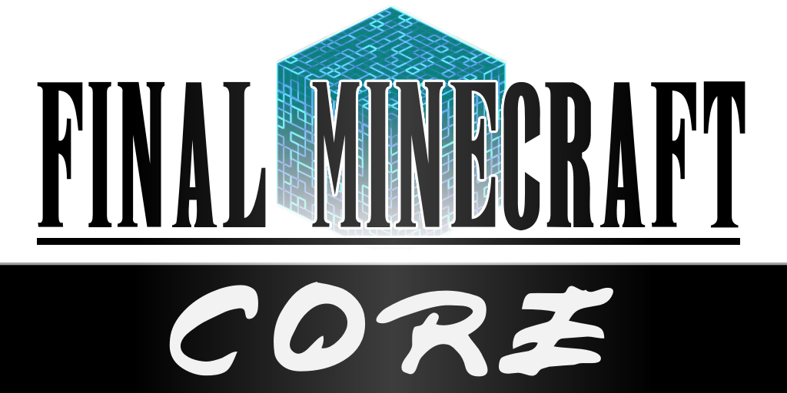

# Final Minecraft Core
### By Lafolie

### *Add elemental aspects to mobs and equipment. Required by other FMC mods.*

### Final Minecraft is a Fabric mod for Minecraft.

## Features

This mod contains basic functionality required by other Final Minecraft (FMC) mods.

The FMC Core provides a limited set of features by itself:

* Elemental aspects (configurable)
* Status effects

With elemental aspects, mobs and players can have weaknesess/resistances, and equipment can have elemental attributes. Elemental aspects can be toggled off in the config.

Status effects exist in the game but require other FMC mods to use.

## Installation

*TODO: add links & versions*

### Supported Versions

FMC Core is a a **Fabric Mod**. A forge version will never be created.

FMC Core currently supports **Minecraft 1.18.2**.

Development will always be targeted at the latest stable release of Minecraft. Older versions will not be supported.

### Client / Server

FMC Core should be installed on both clients and the server.

### Dependencies

FMC Core requires the following mods:
* Fabric API
* Cloth-Config

### Optional Dependencies

FMC Core can utilise, but works without the following mods:
* ModMenu

## Final Minecraft

The Final Minecraft project aims to add Final Fantasy inspired content to Minecraft.

Mods in the FMC mod set include:

* FMC Core *- add elemental aspects to mobs and equipment. Required by other FMC mods*
* FMC Crystals *- add crystal items and blocks to your world*

You can join the official discord here: [https://discord.gg/Kv6umW2vzy](https://discord.gg/Kv6umW2vzy)

## Developers

FMC Core exposes an API for mod developers to create their own FMC mods.

### External Mod Support

FMC Core's Elemental Aspects feature is fully compatible with items, blocks, and mobs supplied by other mods.
Compatibility is achieved via configuration extentions. Players may add their own configurations to their personal installs, but the FMC project aims to provide built-in support for as many mods as possible.

If you are a developer and wish to supply official configuration extentions for external mods please make a pull-request that adds your configuration data to <TODO: create config file>. See here <TODO: docs> for documentation.
*TODO: setup maven on repo*

*TODO: wiki and such*

## License

*TODO: MIT*

This template is available under the CC0 license. Feel free to learn from it and incorporate it in your own projects.
